# Radar Geracional de Tendências de Conteúdo Digital

O projeto integra três fontes públicas — TIC Domicílios 2025 (CETIC.br), YouTube Trending e Google Trends — para investigar diferenças geracionais de consumo de conteúdo e sua relação com sinais de relevância digital observados ao longo de 2025.


> As fontes são públicas e estão referenciadas neste documento, conforme especificação da entrega.


## Contexto de Negócios e Perguntas (Etapa 2 e 4.1)

### Contexto

Ambientes digitais produzem continuamente sinais sobre consumo, interesse e circulação de conteúdo. Entretanto, esses sinais não possuem a mesma natureza: uma pesquisa domiciliar mede comportamento declarado de indivíduos; o YouTube Trending registra conteúdos que ganharam destaque em uma plataforma; e o Google Trends representa interesse relativo de busca.

O desafio deste MVP foi construir uma base analítica que permitisse comparar essas fontes sem tratá-las como equivalentes. Para isso, o projeto organiza, limpa, harmoniza e valida os dados antes de produzir indicadores comparáveis por categoria de conteúdo.

A análise tem como recorte o Brasil e o ano de 2025.

### Objetivo

Construir um pipeline de dados na nuvem capaz de ingerir, tratar, validar, modelar e disponibilizar dados públicos de consumo e tendências de conteúdo digital, permitindo analisar em que medida os conteúdos que ganharam relevância digital em 2025 se aproximam dos tipos de conteúdo consumidos por diferentes faixas etárias.

### Pergunta central

**Em que medida os conteúdos que ganharam relevância digital no Brasil em 2025 estão alinhados aos tipos de conteúdo consumidos por diferentes faixas etárias?**

### Perguntas de negócio

1. Como o consumo dos diferentes tipos de conteúdo varia entre as faixas etárias?
2. Quais categorias apresentaram maior força digital em 2025 a partir dos sinais de YouTube Trending e Google Trends?
3. O ranking de consumo de cada faixa etária se aproxima do ranking de tendência digital?
4. O padrão de alinhamento se mantém quando a comparação é ampliada de cinco categorias para oito categorias utilizando CETIC e YouTube?

### Fontes utilizadas

#### 1. CETIC.br — TIC Domicílios 2025

Foi utilizada a base de microdados da pesquisa TIC Domicílios 2025 para indivíduos. A pesquisa possui abrangência nacional e população-alvo formada por indivíduos com 10 anos ou mais.

Para este MVP foram utilizadas principalmente as seguintes variáveis:

- `QUEST`: identificador do questionário/respondente;
- `FAIXA_ETARIA`: faixa etária;
- `PESO`: peso amostral;
- `TC4B_A`: Notícias;
- `TC4B_B`: Esportes;
- `TC4B_C`: Música;
- `TC4B_D`: Comédia ou programas humorísticos;
- `TC4B_F`: Animações ou desenhos animados;
- `TC4B_G`: Pessoas jogando videogame;
- `TC4B_H`: Tutoriais ou videoaulas;
- `TC4B_I`: Influenciadores digitais.

A base bruta utilizada possui 24.535 registros de indivíduos. Após a ingestão, a tabela Bronze ficou com 478 colunas, considerando as colunas originais e metadados técnicos adicionados pelo pipeline.

**Licença:** Atribuição 4.0 Internacional (CC BY 4.0). A licença permite compartilhamento e adaptação, desde que a fonte seja devidamente atribuída.

Fonte:  
https://cetic.br/pt/arquivos/domicilios/2025/individuos/

Indicador público utilizado como referência de validação:  
https://cetic.br/pt/tics/domicilios/2025/individuos/TC5A/

Licença CC BY 4.0:  
https://creativecommons.org/licenses/by/4.0/

#### 2. YouTube Trending — Kaggle

Foi utilizado o conjunto público **Trending Youtube Video Statistics (113 Countries)**, disponibilizado no Kaggle. O dataset registra snapshots de vídeos em tendência em diversos países e contém informações de vídeo, categoria, data de tendência e métricas públicas de engajamento.

O arquivo histórico global em Parquet foi utilizado como fonte principal. Para o recorte brasileiro de 2025 foram identificadas:

- 72.592 aparições no Trending;
- aproximadamente 32,4 mil vídeos únicos.

Entre os principais campos utilizados estão:

- `video_id`;
- `video_trending_country`;
- `video_trending__date`;
- `video_category_id`;
- `video_view_count`;
- `video_like_count`;
- `video_comment_count`.

Durante a inspeção foi identificado que, apesar do nome `video_category_id`, o campo contém nomes de categorias, como `Gaming`, `Music`, `Sports`, `News & Politics` e outras.

**Licença informada na página da fonte:** ODC Attribution (ODC-By).

Fonte:  
https://www.kaggle.com/datasets/asaniczka/trending-youtube-videos-113-countries

ODC Attribution License:  
https://opendatacommons.org/licenses/by/1-0/

#### 3. Google Trends

Foi utilizada a ferramenta Google Trends, com recorte Brasil, ano de 2025 e Pesquisa Google. Foram exportados dados semanais para cinco tópicos:

- Notícias;
- Esportes;
- Música;
- Humor;
- Jogos eletrônicos.

O arquivo original foi obtido em formato CSV e possuía uma coluna temporal e uma coluna para cada tópico. Na Silver, a estrutura foi convertida para formato longo, com uma observação por semana e categoria.

O Google Trends trabalha com um índice relativo normalizado de 0 a 100. O valor 100 representa o maior nível de interesse relativo dentro da consulta realizada e não deve ser interpretado como percentual absoluto de buscas.

O Google permite reutilizar informações do Trends conforme seus Termos de Serviço e orienta que a fonte seja atribuída quando os dados forem reutilizados.

Fonte:  
https://trends.google.com/trends/

Documentação sobre interpretação dos dados:  
https://support.google.com/trends/answer/4365533?hl=pt-BR

Orientação oficial para uso e citação:  
https://support.google.com/trends/answer/4365538?hl=pt-BR

### Resumo da estrutura dos dados brutos

| Fonte | Formato de origem | Granularidade de origem | Campos relevantes |
|---|---|---|---|
| CETIC.br | CSV | 1 indivíduo por registro | `QUEST`, `FAIXA_ETARIA`, `PESO`, `TC4B_*` |
| YouTube Trending | Parquet | vídeo observado em uma data/país | `video_id`, país, data, categoria, views, likes, comments |
| Google Trends | CSV | 1 semana por linha, categorias em colunas | `Time`, Notícias, Esportes, Música, Humor, Jogo eletrônico |

---

## Carga dos Dados (Etapa 4.2)

### Ambiente de nuvem

Todo o processamento foi realizado no **Databricks Free Edition**, utilizando execução Serverless, Unity Catalog, Volumes, tabelas Delta e notebooks PySpark.

Os arquivos originais foram carregados no seguinte Volume:

```text
/Volumes/workspace/mvp_bronze/raw_files/
```

Organização:

```text
raw_files/
├── cetic_2025/
├── youtube_2025/
└── google_trends_2025/
```

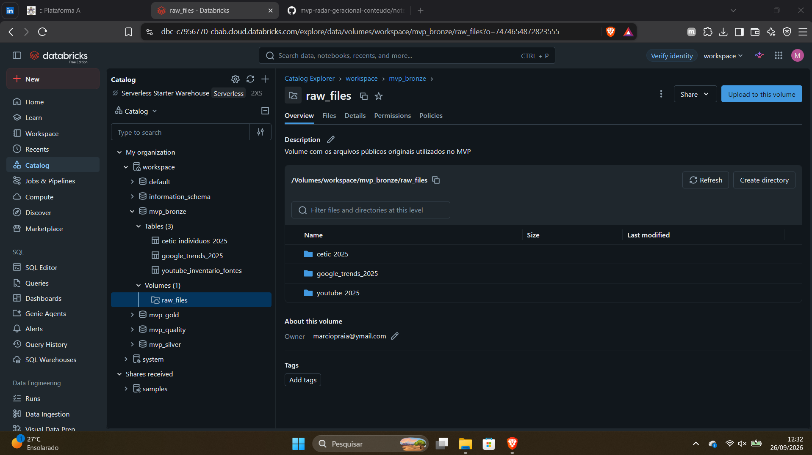

### Estratégia de ingestão

A carga foi separada por fonte:

| Notebook | Responsabilidade |
|---|---|
| `01_bronze_cetic` | leitura e persistência dos microdados CETIC |
| `02_bronze_youtube` | inspeção, inventário e leitura da fonte YouTube |
| `03_bronze_google_trends` | leitura e persistência do CSV do Google Trends |

Todo o código está disponível na pasta [`notebooks/`](notebooks/).

### Bronze CETIC

A base CETIC foi lida preservando inicialmente os campos como texto, evitando coerções prematuras de tipo. Foram adicionados metadados de rastreabilidade, como fonte, ano de referência, data de ingestão e arquivo de origem.

Tabela criada:

```text
workspace.mvp_bronze.cetic_individuos_2025
```

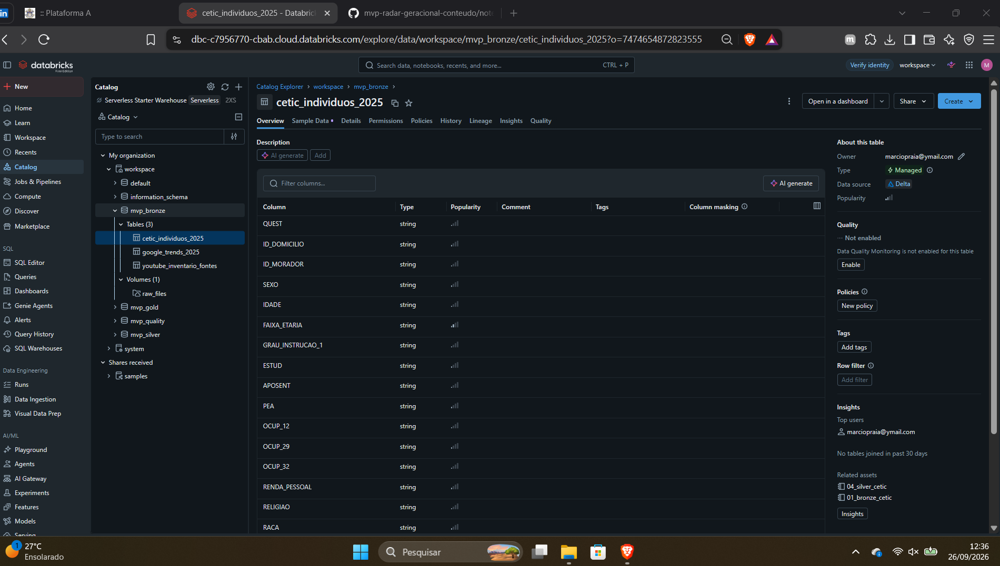

### Bronze YouTube

O arquivo global histórico do YouTube possui aproximadamente 4,25 GB. Para evitar duplicação desnecessária de um arquivo já persistido no Volume, o Parquet original foi mantido na área bruta e foi criada uma tabela de inventário das fontes:

```text
workspace.mvp_bronze.youtube_inventario_fontes
```

A Silver lê diretamente o arquivo bruto preservado no Volume e aplica o recorte `Brazil` e ano 2025.

### Bronze Google Trends

O CSV exportado do Google Trends foi carregado no Volume, teve os nomes de colunas normalizados para compatibilidade com Delta e foi persistido em:

```text
workspace.mvp_bronze.google_trends_2025
```

Essa estratégia mantém as fontes originais rastreáveis e separa a ingestão das etapas posteriores de tratamento.

---

## Modelagem e Catálogo de Dados (Etapa 4.3)

### Estratégia de modelagem

Neste projeto foi adotado um modelo **Lakehouse em arquitetura Medallion**, com tabelas orientadas por fonte nas camadas Bronze e Silver e tabelas analíticas por conceito na camada Gold.

Foram criados quatro schemas:

```text
workspace.mvp_bronze
workspace.mvp_silver
workspace.mvp_quality
workspace.mvp_gold
```

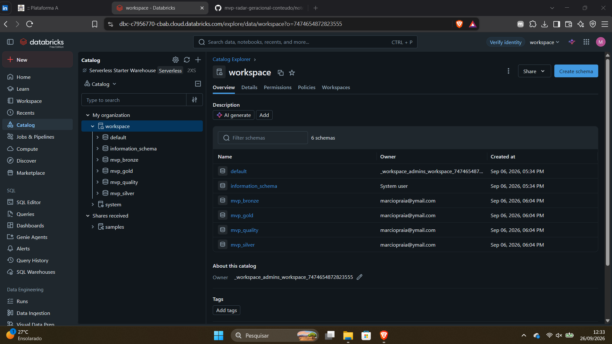

### Linhagem dos dados

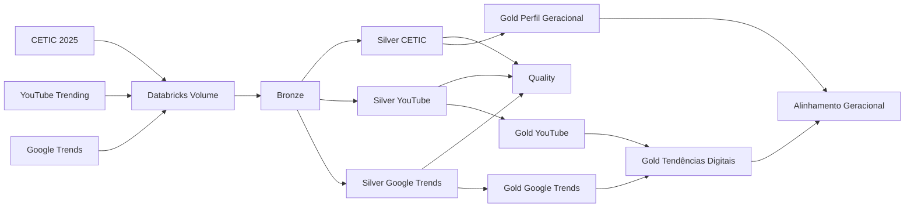

### Catálogo de tabelas

| Camada | Tabela | Granularidade | Finalidade |
|---|---|---|---|
| Bronze | `cetic_individuos_2025` | indivíduo | preservação dos microdados CETIC e metadados de ingestão |
| Bronze | `google_trends_2025` | semana | preservação da exportação do Google Trends com nomes normalizados |
| Bronze | `youtube_inventario_fontes` | arquivo | inventário dos arquivos brutos do YouTube mantidos no Volume |
| Silver | `consumo_digital_cetic_2025` | respondente × categoria | consumo de conteúdo harmonizado por pessoa e categoria |
| Silver | `youtube_trending_br_2025` | vídeo × data de Trending | registros brasileiros de 2025 tratados e categorizados |
| Silver | `google_trends_2025` | semana × categoria | série temporal semanal em formato longo |
| Quality | `resultados_qualidade` | regra de qualidade | resultado detalhado dos testes de qualidade |
| Quality | `resumo_qualidade` | fonte × status | resumo dos testes executados |
| Gold | `perfil_geracional_cetic_2025` | faixa etária × categoria | percentual ponderado de consumo e ranking por faixa |
| Gold | `tendencias_youtube_2025` | categoria | presença e participação das categorias no YouTube Trending |
| Gold | `interesse_google_2025` | categoria | estatísticas agregadas do índice Google Trends |
| Gold | `tendencias_digitais_nucleo_2025` | categoria | combinação dos sinais YouTube + Google Trends |
| Gold | `alinhamento_geracional_2025` | faixa etária × categoria | comparação entre ranking de consumo e ranking digital |
| Gold | `resumo_alinhamento_geracional_2025` | faixa etária | síntese do alinhamento por grupo etário |
| Gold | `alinhamento_cetic_youtube_ampliado_2025` | faixa etária × categoria | comparação ampliada de oito categorias CETIC × YouTube |

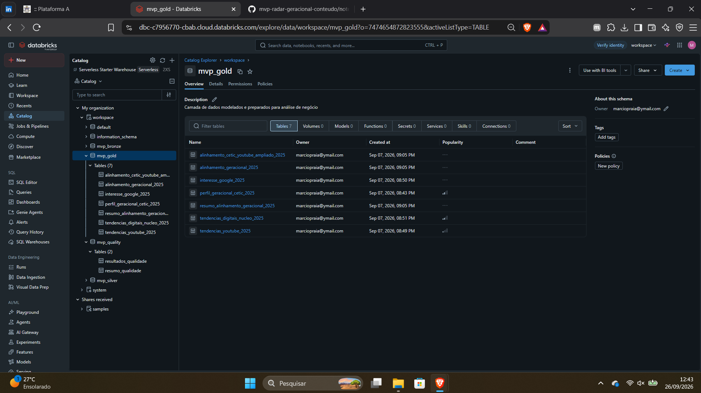

### Catálogo de campos — Silver CETIC

| Campo | Tipo | Descrição | Domínio / regra esperada |
|---|---|---|---|
| `ano_referencia` | int | ano de referência | 2025 |
| `id_respondente` | string | identificador do respondente | não nulo |
| `faixa_etaria_codigo` | int | código da faixa etária | 1 a 6 |
| `faixa_etaria` | string | faixa etária harmonizada | `10-15`, `16-24`, `25-34`, `35-44`, `45-59`, `60+` |
| `categoria` | string | tipo de conteúdo | 8 categorias harmonizadas |
| `resposta_original` | string | valor preservado da fonte | sem alteração |
| `resposta_codigo` | int | código tratado da resposta | `0`, `1`, `97`, `98`, `99` |
| `resposta` | int | variável binária usada na análise | `1=Sim`, `0=Não`, `null` para respostas especiais |
| `resposta_valida` | boolean | indica uso no cálculo do percentual | `true` para Sim/Não |
| `status_resposta` | string | descrição do código | Sim, Não, Não sabe, Não respondeu, Não se aplica |
| `peso` | double | peso amostral CETIC | valor positivo |
| `fonte` | string | origem do registro | CETIC.br |
| `_data_processamento` | timestamp | momento do processamento | timestamp válido |

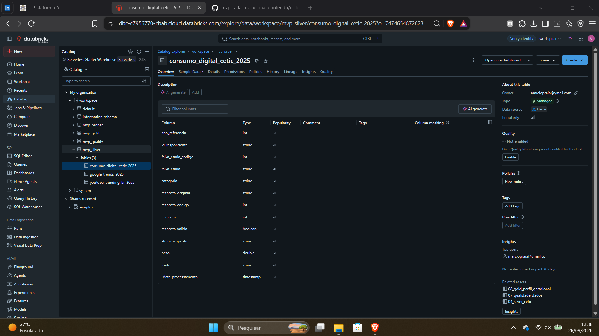

### Catálogo de campos — Silver YouTube

| Campo | Tipo | Descrição | Domínio / regra esperada |
|---|---|---|---|
| `video_id` | string | identificador do vídeo | não nulo |
| `data_trending` | date | data em que o vídeo foi observado | ano de 2025 |
| `categoria_original` | string | categoria recebida da fonte | categorias originais do YouTube |
| `categoria` | string | categoria harmonizada | núcleo, ampliada ou `Não comparável` |
| `nivel_comparabilidade` | string | segurança da equivalência semântica | `Direta`, `Aproximada`, `Fraca`, `Não comparável` |
| `categoria_comparavel` | boolean | inclusão na comparação principal/ampliada | verdadeiro/falso |
| `views` | bigint | visualizações no snapshot | >= 0 |
| `likes` | bigint | curtidas no snapshot | >= 0 |
| `comments` | bigint | comentários no snapshot | >= 0 |
| `primeira_data_trending` | date | primeira observação do vídeo | <= última data |
| `ultima_data_trending` | date | última observação do vídeo | >= primeira data |

### Catálogo de campos — Silver Google Trends

| Campo | Tipo | Descrição | Domínio / regra esperada |
|---|---|---|---|
| `data_semana` | date | início da semana da observação | série semanal |
| `categoria` | string | tópico harmonizado | Notícias, Esportes, Música, Humor, Games |
| `indice_trends` | int | interesse relativo | 0 a 100 |
| `periodo_referencia` | string | identificação da janela analisada | 2025 / semana de transição |
| `ano_semana` | int | ano associado à semana | 2024 ou 2025 conforme início da semana |

### Catálogo de campos — principais tabelas Gold

| Campo | Tabela | Tipo / domínio | Descrição |
|---|---|---|---|
| `percentual_consumo` | `perfil_geracional_cetic_2025` | 0 a 100 | percentual ponderado de consumo |
| `ranking_categoria_na_faixa` | `perfil_geracional_cetic_2025` | 1 a 8 | posição da categoria dentro da faixa |
| `videos_unicos` | `tendencias_youtube_2025` | >= 0 | quantidade de vídeos distintos |
| `aparicoes_trending` | `tendencias_youtube_2025` | >= 0 | número de registros da categoria no Trending |
| `participacao_videos_pct` | `tendencias_youtube_2025` | 0 a 100 | participação no total de vídeos únicos |
| `indice_medio` | `interesse_google_2025` | 0 a 100 | média do índice semanal do Google Trends |
| `score_youtube_0_100` | `tendencias_digitais_nucleo_2025` | 0 a 100 | sinal YouTube normalizado |
| `score_google_0_100` | `tendencias_digitais_nucleo_2025` | 0 a 100 | sinal Google normalizado |
| `score_tendencia_digital` | `tendencias_digitais_nucleo_2025` | 0 a 100 | média simples dos dois sinais |
| `ranking_tendencia_digital` | `tendencias_digitais_nucleo_2025` | 1 a 5 | ranking do núcleo multifuente |
| `diferenca_ranking` | `alinhamento_geracional_2025` | 0 a 4 | diferença absoluta entre posições |
| `correlacao_ranking` | `resumo_alinhamento_geracional_2025` | -1 a 1 | associação entre os dois rankings |

O dicionário completo das centenas de variáveis originais da TIC Domicílios não foi reproduzido neste README. Para a camada bruta, utiliza-se como referência o dicionário oficial do CETIC.br; o catálogo acima documenta os campos efetivamente utilizados e os campos derivados pelo MVP.

---

## Pipeline de Dados (Etapa 4.4)

O pipeline foi dividido em notebooks independentes por fonte e por etapa. A separação evita que ingestão, tratamento, qualidade e análise fiquem acoplados em um único notebook e facilita a rastreabilidade das transformações.

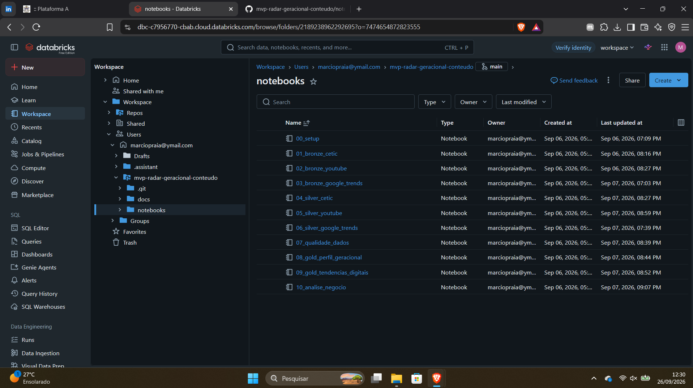

### Organização dos notebooks

| Ordem | Notebook | Função |
|---:|---|---|
| 00 | `00_setup` | configuração de schemas e estruturas do projeto |
| 01 | `01_bronze_cetic` | ingestão CETIC |
| 02 | `02_bronze_youtube` | ingestão/inventário YouTube |
| 03 | `03_bronze_google_trends` | ingestão Google Trends |
| 04 | `04_silver_cetic` | limpeza, tipagem e harmonização CETIC |
| 05 | `05_silver_youtube` | filtro Brasil/2025, tipagem e taxonomia YouTube |
| 06 | `06_silver_google_trends` | tipagem e transformação wide-to-long |
| 07 | `07_qualidade_dados` | validações consolidadas das três fontes |
| 08 | `08_gold_perfil_geracional` | perfil geracional ponderado |
| 09 | `09_gold_tendencias_digitais` | agregações YouTube/Google e score digital |
| 10 | `10_analise_negocio` | cruzamento final e respostas às perguntas |

### Transformações principais

#### CETIC

1. seleção das variáveis de faixa etária, peso e oito tipos de conteúdo;
2. preservação de `QUEST` como `id_respondente`;
3. conversão do peso amostral para `double`;
4. padronização de seis faixas etárias;
5. transformação das oito colunas de conteúdo para formato longo com `stack`;
6. preservação do valor original e criação de código/status de resposta;
7. definição de `1=Sim` e `0=Não` como respostas válidas para o cálculo;
8. exclusão de respostas especiais do denominador analítico;
9. geração de 196.280 registros Silver (`24.535 respondentes × 8 categorias`);
10. agregação ponderada na Gold por faixa etária e categoria.

#### YouTube

1. leitura do Parquet global;
2. filtro do país `Brazil`;
3. conversão da data original `YYYY.MM.DD` para `date`;
4. filtro do ano de 2025;
5. tipagem de views, likes e comentários;
6. harmonização da taxonomia;
7. classificação do nível de comparabilidade;
8. cálculo da permanência no Trending;
9. seleção do último snapshot de cada vídeo para métricas acumuladas;
10. agregação por categoria.

A decisão de utilizar o último snapshot evita somar views, likes e comentários do mesmo vídeo em vários dias, o que produziria dupla contagem de métricas acumuladas.

#### Google Trends

1. normalização dos nomes de colunas;
2. conversão da data para `date`;
3. conversão dos índices para inteiro;
4. transformação de cinco colunas de tópicos para formato longo;
5. preservação da semana iniciada em `2024-12-29`, pois ela representa a janela semanal que atravessa o início de 2025;
6. agregação por categoria para a Gold.

### Persistência

As saídas são armazenadas como tabelas Delta no Unity Catalog. Isso permite verificar visualmente schemas, colunas, linhagem e persistência dos dados no ambiente de nuvem.

---

## Qualidade de Dados (Etapa 4.5)

A qualidade foi avaliada antes da construção da Gold. Foram consideradas as dimensões de completude, unicidade, validade, consistência, domínio, integridade e possíveis outliers.

Os resultados foram persistidos em:

```text
workspace.mvp_quality.resultados_qualidade
workspace.mvp_quality.resumo_qualidade
```

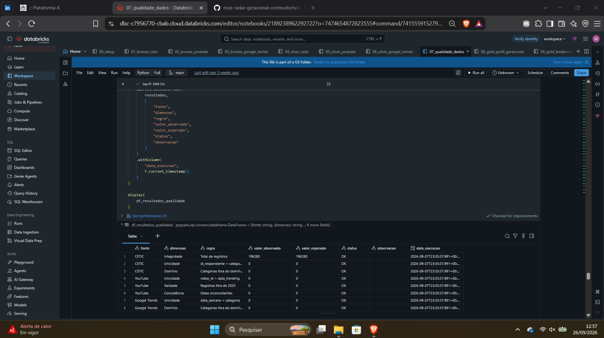

### Principais verificações

#### CETIC

- chave lógica: `id_respondente + categoria`;
- validação das seis faixas etárias;
- validação das oito categorias;
- peso amostral positivo;
- domínio dos códigos de resposta;
- consistência estrutural entre quantidade de respondentes e categorias.

O resultado esperado da estrutura é:

```text
24.535 respondentes × 8 categorias = 196.280 registros
```

A combinação `id_respondente + categoria` não deve apresentar duplicidade.

#### YouTube

- chave lógica: `video_id + data_trending`;
- datas restritas ao recorte de 2025;
- views, likes e comments não negativos;
- nível de comparabilidade dentro do domínio definido;
- coerência entre primeira e última data no Trending;
- análise de possíveis outliers por IQR.

Valores extremos de engajamento não foram removidos automaticamente, pois, nesse contexto, podem representar vídeos genuinamente virais.

#### Google Trends

- chave lógica: `data_semana + categoria`;
- ausência de duplicidade nessa granularidade;
- domínio do índice entre 0 e 100;
- domínio das cinco categorias;
- verificação da semana de transição iniciada em 29/12/2024.

### Problemas identificados e tratamentos

#### 1. Codificação das respostas do CETIC

A documentação do instrumento de coleta apresenta os códigos aplicados durante a entrevista, enquanto o arquivo de microdados efetivamente carregado apresentou recodificação própria para as variáveis utilizadas no pipeline.

Na base processada foram observados:

```text
1  = Sim
0  = Não
97 = Não sabe
98 = Não respondeu
99 = Não se aplica
```

Durante a validação foi identificado que o código `0` precisava ser tratado como resposta válida "Não". Sem esse tratamento, apenas as respostas "Sim" permaneciam no denominador e os percentuais de consumo resultavam artificialmente em 100%.

A regra foi corrigida na Silver, a Gold foi recalculada e a análise final foi reexecutada.

Além disso, `99 = Não se aplica` não foi considerado erro de completude: a pergunta sobre tipos de vídeo é condicionada ao universo de respondentes que assistiram conteúdo em vídeo pela Internet.

#### 2. Taxonomia do YouTube

O campo `video_category_id` contém nomes de categorias e não identificadores numéricos. A taxonomia foi harmonizada em três níveis de segurança:

**Comparação direta**
- Gaming → Games
- Music → Música
- Sports → Esportes
- News & Politics → Notícias
- Comedy → Humor
- Film & Animation → Animações

**Comparação aproximada**
- Education → Tutoriais / Educação
- People & Blogs → Influenciadores

**Comparação fraca**
- Howto & Style → Lifestyle / How-to

As demais categorias foram preservadas como não comparáveis e não foram forçadas para o núcleo analítico.

#### 3. Repetição de vídeos no YouTube

O mesmo vídeo pode aparecer no Trending em vários dias. Essa recorrência é uma característica da fonte e não uma duplicidade.

Por isso:

- `video_id` isoladamente não foi considerado chave;
- a granularidade Silver foi definida como `video_id + data_trending`;
- views, likes e comments não foram somados entre snapshots;
- o último snapshot foi utilizado para métricas de engajamento por vídeo.

#### 4. Google Trends

Os índices do Google Trends são relativos. Eles foram mantidos no domínio 0–100 e não foram tratados como percentuais da população.

Após os tratamentos e a reexecução dos testes críticos, as tabelas Silver foram consideradas adequadas para alimentar a camada Gold.

---

## Análise de Dados (Etapa 4.5)

### Metodologia da análise

As três fontes não medem exatamente o mesmo fenômeno:

- CETIC mede comportamento declarado de consumo;
- YouTube Trending mede presença de conteúdos no ranking da plataforma;
- Google Trends mede interesse relativo de pesquisa.

Por isso, os valores absolutos não foram comparados diretamente.

A análise foi organizada em dois níveis:

**Núcleo multifuente:** cinco categorias presentes nas três fontes:

- Notícias;
- Esportes;
- Música;
- Humor;
- Games.

**Comparação ampliada:** oito categorias comparáveis entre CETIC e YouTube, acrescentando:

- Animações;
- Tutoriais / Educação;
- Influenciadores.

### Construção do indicador de tendência digital

No núcleo de cinco categorias, a participação de vídeos únicos no YouTube foi normalizada para escala 0–100, considerando como 100 a categoria de maior participação.

O índice médio do Google Trends também foi normalizado em relação ao maior valor observado entre as cinco categorias.

O indicador final foi calculado por média simples:

```text
score_tendencia_digital =
(score_youtube_0_100 + score_google_0_100) / 2
```

Foi adotado peso igual de 50% para cada fonte. Esse score é uma construção analítica deste MVP e não representa percentual da população nem métrica oficial das plataformas.

### Pergunta 1 — Como o consumo varia entre as faixas etárias?

A análise ponderada do CETIC mostra diferenças claras entre os grupos etários.

Como referência de leitura, os percentuais arredondados reproduzem o padrão publicado pelo próprio CETIC para 2025:

| Faixa etária | Categorias de maior incidência |
|---|---|
| 10–15 | Animações (64%), Influenciadores (62%) e Música (50%) |
| 16–24 | Notícias (64%), Música (64%) e Humor (63%) |
| 25–34 | Notícias (68%), Música (65%) e Humor (59%) |
| 35–44 | Notícias (53%), Música (49%) e Humor (43%) |
| 45–59 | Notícias (43%), Música (36%) e Humor (28%) |
| 60+ | Notícias (16%), Música (13%) e Esportes (11%) |

O comportamento mais jovem apresenta maior presença de animações, influenciadores e conteúdo relacionado a jogos. A partir dos 25 anos, Notícias e Música assumem maior peso relativo. Também se observa queda geral dos percentuais nas faixas mais altas, especialmente para Games.

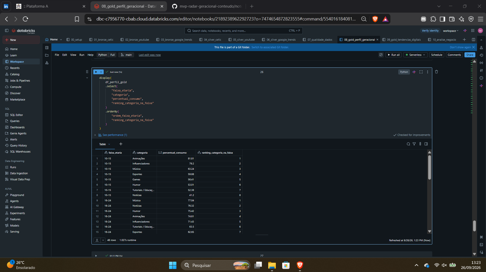

### Pergunta 2 — Quais categorias apresentaram maior força digital em 2025?

No núcleo multifuente, o ranking construído pelo MVP foi:

| Ranking | Categoria | Participação de vídeos no YouTube | Índice médio Google Trends | Score digital |
|---:|---|---:|---:|---:|
| 1 | Música | 19,80% | 75,13 | 68,64 |
| 2 | Games | 53,12% | 15,58 | 60,37 |
| 3 | Esportes | 4,92% | 27,51 | 22,94 |
| 4 | Notícias | 0,52% | 25,70 | 17,60 |
| 5 | Humor | 0,37% | 1,00 | 1,02 |

O resultado evidencia uma diferença entre os dois sinais. Games domina a presença de vídeos no YouTube Trending, enquanto Música apresenta interesse de busca muito superior no Google Trends. A combinação das fontes coloca Música e Games nas duas primeiras posições, mas por razões distintas.

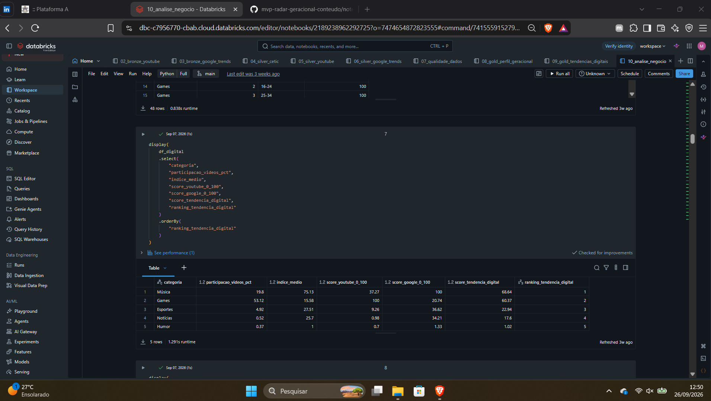

### Pergunta 3 — O ranking de consumo das faixas etárias está alinhado ao ranking digital?

A comparação foi feita pelas posições relativas das cinco categorias, e não pela igualdade dos valores absolutos.

O grupo de 10 a 15 anos é o que apresenta o padrão mais próximo do ranking digital: Música, Esportes e Games também aparecem em posições altas no consumo desse grupo. Nas demais faixas, o alinhamento diminui porque Notícias e Música ganham importância no consumo declarado, enquanto Games permanece em posição elevada no sinal digital consolidado.

Entre 25 e 59 anos, a principal diferença é a posição de Games: a categoria permanece muito forte no YouTube, mas ocupa posição baixa no consumo declarado dessas faixas. Ao mesmo tempo, Notícias lidera ou aparece entre as primeiras posições de consumo adulto, mas fica apenas na quarta posição do ranking digital consolidado.

Na faixa de 60 anos ou mais, o volume declarado de consumo é menor para todas as categorias e o ordenamento também se distancia do sinal digital, embora Esportes mantenha posição intermediária nas duas visões.

A análise deve ser interpretada como associação de rankings, não como evidência causal de que uma faixa etária determine o que se torna tendência.

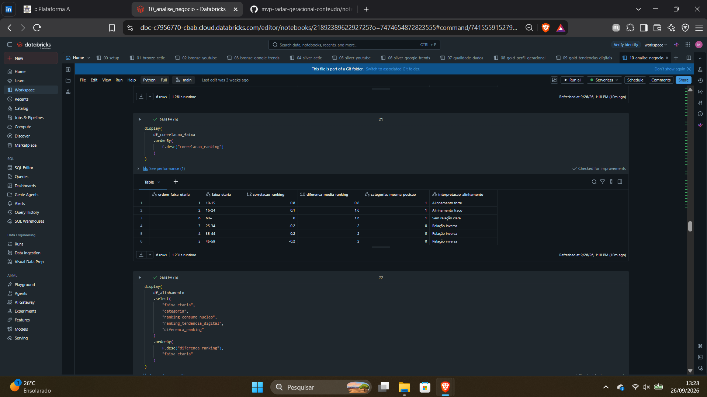

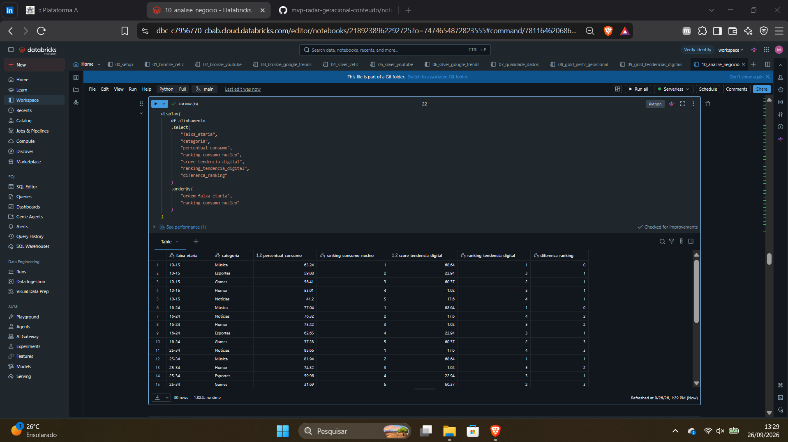

### Pergunta 4 — O resultado se mantém na comparação ampliada CETIC × YouTube?

A análise ampliada acrescenta Animações, Tutoriais / Educação e Influenciadores, chegando a oito categorias.

No YouTube, Games permanece com a maior quantidade de vídeos únicos entre as categorias harmonizadas, seguido por Música. Influenciadores também ganha relevância por causa do mapeamento aproximado de `People & Blogs`.

Quando o conjunto é ampliado, a aproximação entre o perfil dos mais jovens e o comportamento da plataforma continua maior do que nos grupos adultos. Para as faixas mais altas, o consumo declarado continua concentrado em Notícias, Música e Humor, enquanto Games mantém peso elevado na plataforma.

Essa leitura ampliada deve ser feita com mais cautela porque parte das equivalências semânticas é aproximada. Por esse motivo, a conclusão principal do MVP utiliza o núcleo de cinco categorias, enquanto a comparação com oito categorias funciona como análise complementar.

### Resposta à pergunta central

Os resultados indicam que **não existe um alinhamento uniforme entre tendência digital e consumo declarado para todas as faixas etárias**.

O alinhamento é mais evidente entre os mais jovens, especialmente na faixa de 10 a 15 anos, onde categorias fortes no ambiente digital também ocupam posições relevantes no consumo. À medida que a idade aumenta, o perfil declarado se desloca para Notícias e Música e se afasta da forte presença de Games observada no YouTube.

Música apresenta comportamento mais transversal: ocupa posição de destaque no sinal digital e também aparece entre as categorias mais consumidas em várias faixas etárias. Games, por outro lado, representa o principal caso de diferença entre relevância de plataforma e consumo declarado da população adulta.

Portanto, o pipeline sugere que a relevância digital de uma categoria não deve ser interpretada como representação direta do consumo de todos os grupos da população. A composição etária é importante para contextualizar sinais de tendência observados em plataformas digitais.

---

## Limitações

As conclusões devem ser interpretadas considerando as seguintes limitações:

1. **Natureza diferente das fontes.** CETIC, YouTube e Google Trends medem comportamentos distintos e não formam uma única pesquisa integrada.
2. **YouTube não representa toda a Internet.** O Trending reflete critérios e dinâmica próprios da plataforma.
3. **Google Trends é relativo.** O índice não corresponde ao volume absoluto de pesquisas e incorpora amostragem e normalização.
4. **Comportamento declarado.** O CETIC é uma pesquisa amostral baseada em respostas dos indivíduos, diferente de telemetria de plataforma.
5. **Harmonização de categorias.** Algumas equivalências do YouTube são aproximadas, especialmente `People & Blogs` e `Education`.
6. **Score digital.** O peso de 50% YouTube e 50% Google Trends é uma decisão metodológica do MVP, utilizada para comparação e não como índice oficial.
7. **Recorte temporal.** O estudo representa 2025 e não permite afirmar que os padrões permanecerão iguais em outros períodos.
8. **Associação, não causalidade.** Os resultados descrevem proximidade ou diferença entre padrões e não demonstram relação causal entre idade e viralização.

---

## Autoavaliação

O objetivo inicialmente proposto foi atingido, pois foi possível construir um pipeline completo em ambiente de nuvem, desde a ingestão dos arquivos brutos até a disponibilização de tabelas analíticas capazes de responder à pergunta central do MVP. A integração de três fontes permitiu ir além de uma análise isolada de plataforma e trouxe uma dimensão geracional para a interpretação das tendências digitais.

A principal dificuldade foi tornar comparáveis dados produzidos com finalidades e granularidades diferentes. A TIC Domicílios trabalha com pesquisa amostral e peso estatístico; o YouTube possui múltiplos snapshots do mesmo vídeo; e o Google Trends fornece um índice relativo. Isso exigiu decisões de modelagem específicas para não transformar métricas distintas em medidas artificialmente equivalentes.

Outro ponto importante foi a validação dos códigos de resposta do arquivo de microdados CETIC. Durante os testes, foi identificado que o código correspondente à resposta "Não" precisava ser incluído entre as respostas válidas. A inconsistência ficou evidente porque os percentuais calculados inicialmente chegavam a 100% para todas as categorias. A correção foi feita na Silver e todas as etapas dependentes foram reexecutadas. Esse episódio reforçou a importância de validar não apenas schema e tipos, mas também o domínio efetivamente observado nos dados antes de construir indicadores.

No YouTube, o tamanho do arquivo histórico e a repetição diária de vídeos também exigiram cuidado. Manter o arquivo bruto no Volume, em vez de criar uma cópia adicional de vários gigabytes em Delta, foi uma decisão de uso de recursos. Na análise, a opção por utilizar o último snapshot para métricas acumuladas evitou dupla contagem.

Considero que o MVP cumpriu seu propósito de exercitar o fluxo de Engenharia de Dados de ponta a ponta. Além da construção técnica, o projeto evidenciou que uma análise só se torna confiável quando as regras de qualidade, granularidade e significado dos indicadores são tratadas explicitamente.

Como evolução futura, o projeto pode:

- automatizar a atualização das três fontes;
- incluir novas plataformas digitais, como TIKTOK, Instagram (Reels), Twitter;
- ampliar o período para permitir comparação entre anos;
- testar diferentes métodos de normalização e pesos para o score digital;
- realizar análise de sensibilidade do score;
- explorar recortes de região, escolaridade, renda e outras características disponíveis no CETIC;
- aprofundar a classificação semântica das categorias do YouTube;
- disponibilizar uma camada de visualização ou dashboard a partir das tabelas Gold;
- incluir testes automatizados de qualidade executados a cada nova carga.

---

## Evidências de Execução no Databricks

As evidências visuais foram mantidas no diretório `docs/evidencias/` e inseridas ao longo deste README, de acordo com a etapa que comprovam.

| Evidência | Requisito demonstrado |
|---|---|
| `01_estrutura_notebooks_databricks.png` | execução e organização do pipeline na plataforma de nuvem |
| `02_volume_fontes_brutas.png` | arquivos de origem persistidos em Volume |
| `03_schemas_medallion.png` | modelagem e schemas Bronze/Silver/Quality/Gold |
| `04_tabela_bronze_catalog.png` | tabela Bronze persistida e schema |
| `05_silver_cetic_catalog.png` | tabela Silver tratada e tipos dos campos |
| `06_resultados_qualidade.png` | testes de qualidade executados |
| `07_tabelas_gold_persistidas.png` | tabelas analíticas persistidas |
| `08_perfil_consumo_por_faixa.png` | resultado da análise de perfil geracional |
| `09_ranking_tendencias_digitais.png` | resultado do ranking digital |
| `10_alinhamento_por_faixa_etaria.png` | resposta consolidada de alinhamento |
| `11_detalhe_alinhamento_categoria.png` | detalhamento da comparação dos rankings |

---

## Referências

**CETIC.br / NIC.br.** TIC Domicílios 2025 — Microdados e documentação.  
https://cetic.br/pt/arquivos/domicilios/2025/individuos/

**CETIC.br / NIC.br.** TIC Domicílios 2025 — Indivíduos por tipo de conteúdo dos vídeos assistidos pela Internet.  
https://cetic.br/pt/tics/domicilios/2025/individuos/TC5A/

**Creative Commons.** Attribution 4.0 International — CC BY 4.0.  
https://creativecommons.org/licenses/by/4.0/

**Kaggle / asaniczka.** Trending Youtube Video Statistics (113 Countries).  
https://www.kaggle.com/datasets/asaniczka/trending-youtube-videos-113-countries

**Open Data Commons.** ODC Attribution License (ODC-By).  
https://opendatacommons.org/licenses/by/1-0/

**Google.** Google Trends.  
https://trends.google.com/trends/

**Google Trends Help.** Perguntas frequentes sobre os dados do Google Trends.  
https://support.google.com/trends/answer/4365533?hl=pt-BR

**Google Trends Help.** Exportar, incorporar e citar dados do Trends.  
https://support.google.com/trends/answer/4365538?hl=pt-BR
